# Red Social "FandomFlix 🖤🎥💻"
- Link al proyecto  [aquí]()

## Índice

* [1. Introducción](#1-introducción)
* [2. Investigación de Experiencia de Usuario (UX)](#2-investigación-de-experiencia-de-usuario-ux)
* [3. Diseño de Interfaz de Usuario (UI)](#3-diseño-de-interfaz-de-usuario-ui)
* [4. Herramientas de Elaboración](#4-herramientas-de-elaboración)
* [5. Pruebas unitarias (unit tests)](#5-pruebas-unitarias-unit-tests)

## 1. Introducción 👋

FandomFlix es el destino ideal para los apasionados del cine que desean compartir sus experiencias cinematográficas. En nuestra plataforma, los amantes del séptimo arte pueden plasmar sus opiniones y reseñas sobre las películas que han disfrutado, brindando recomendaciones y críticas constructivas. Impulsa a otros cinéfilos a explorar nuevas películas en base a las recomendaciones y valoraciones de la comunidad, formando así una red de intercambio de ideas y emociones cinéfilas.

## 1.1 Definición del proyecto🔍
- El proyecto consiste en una aplicación web innovadora y moderna construida como una Single Page Application (SPA), centrada en la comunidad de fanáticos de películas y series. La aplicación presenta un enfoque de diseño adaptable desde dispositivos móviles, habiendo sido desarrollada siguiendo la metodología 'Mobile First' y haciendo uso de CSS Grid para lograr una experiencia de usuario fluida en diferentes tamaños de pantalla.
- La esencia de la aplicación se basa en la posibilidad de compartir contenido relacionado con películas y series. Los usuarios pueden crear y compartir reseñas, recomendaciones e imágenes. La plataforma fomenta la interacción social al permitir a los usuarios comentar y expresar su aprobación mediante la función de 'likes' en las publicaciones de otros.
- Una característica destacada de este proyecto es la integración de Firebase, una plataforma de desarrollo de aplicaciones en la nube, que proporciona la infraestructura de backend. Esta elección tecnológica permite un almacenamiento eficiente de datos, autenticación segura de usuarios y la implementación de funciones en tiempo real, enriqueciendo así la experiencia de los usuarios.

## 1.2 Imagen final del sitio. 🎉

### Página de Inicio de Sesión: Acceso Rápido y Seguro
La página de inicio de sesión es la puerta de entrada a nuestra plataforma. Aquí, los usuarios tienen la posibilidad de acceder a sus cuentas previamente registradas, brindándoles acceso a una experiencia personalizada. Además, ofrecemos la opción de iniciar sesión mediante Google, para agilizar el proceso y garantizar la seguridad de la información.
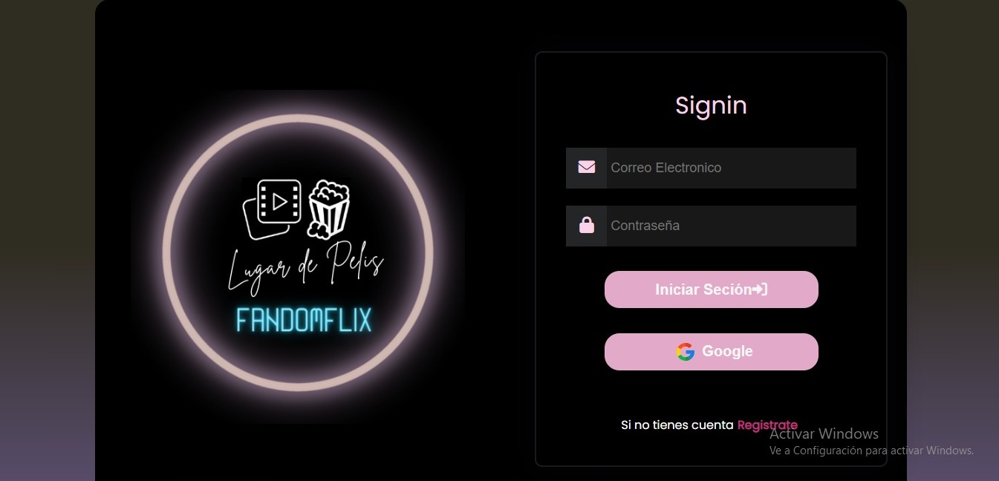

### Página de Registro: Únete a Nuestra Comunidad

La página de registro es el primer paso para unirse a nuestra comunidad. Aquí, los nuevos usuarios pueden crear sus cuentas personalizadas proporcionando información esencial como su nombre, dirección de correo electrónico y una contraseña segura. Además, hemos simplificado el proceso al ofrecer la opción de registrarse utilizando cuentas de Google. Esta página es crucial para establecer una base sólida en nuestra plataforma y permitir que los usuarios aprovechen al máximo lo que tenemos para ofrecer. Echa un vistazo a la captura de pantalla a continuación para ver cómo es el proceso:
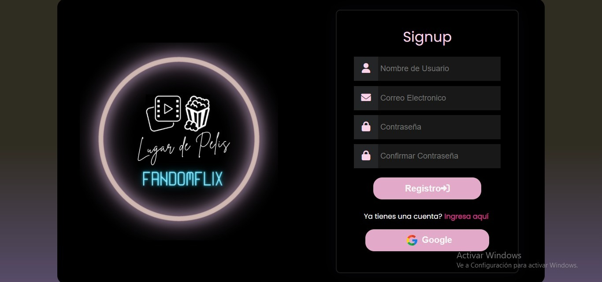

### Página de Inicio: Explora y Comparte Tu Pasión Cinéfila

Una vez que hayas iniciado sesión, justo al comienzo de la página, encontrarás un espacio dedicado para expresarte. Puedes compartir tus pensamientos, reseñas y recomendaciones sobre películas y series. También tienes el control total sobre tus publicaciones: puedes editarlas o borrarlas según tus necesidades.

Además, promovemos la interacción y la conexión entre los usuarios. Puedes darle "like" a cualquier publicación que te guste, lo que permite mostrar tu aprecio por las recomendaciones de otros y crear una comunidad cinéfila vibrante y activa.

La siguiente imagen ilustra cómo se ve esta experiencia en nuestra plataforma:
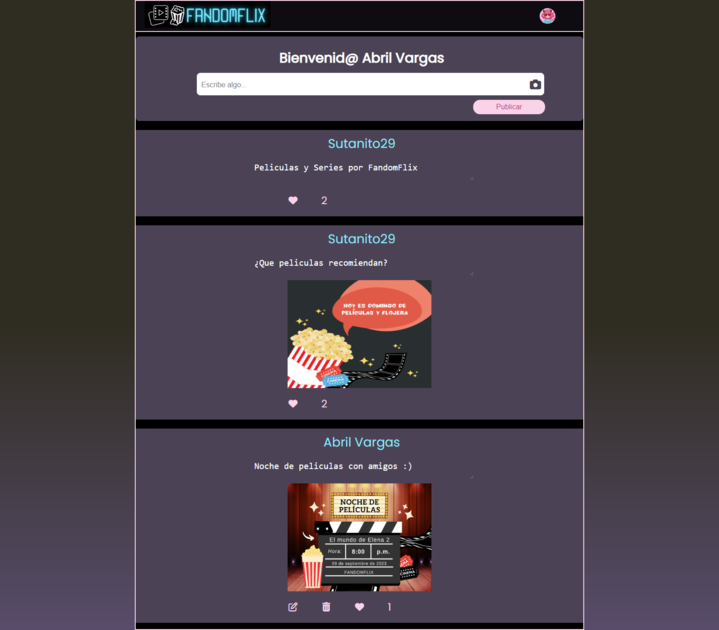

### El diseño es responsive por lo cual se adapta a diferentes tamaños de pantalla.
A continuacion mostrare como se ve en móvil

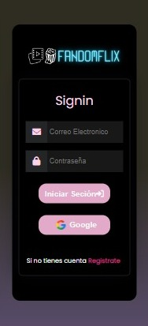 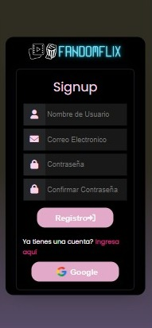 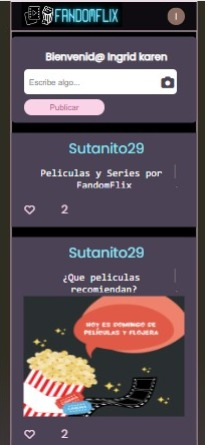

## 2. Investigación de Experiencia de Usuario (UX) 🧐

### ¿Quiénes son los principales usuarios de producto?
* R: Los destinatarios principales de nuestra plataforma son los entusiastas devotos de películas y series. Nuestro producto está cuidadosamente concebido para proporcionar una experiencia enriquecedora a aquellos que comparten una profunda pasión por la cinematografía. Desde aficionados casuales hasta cinéfilos apasionados.

### ¿Cuáles son los objetivos de estos usuarios en relación con el producto?
* R:   Buscan la oportunidad de compartir sus propias recomendaciones de películas y series que han disfrutado, contribuyendo así a una comunidad que valora la crítica y la exploración audiovisual. Además, desean explorar el contenido publicado por otros usuarios, permitiéndoles descubrir qué películas y series están siendo recomendadas en el momento. Nuestra plataforma se esfuerza por ser un espacio dinámico y colaborativo donde los aficionados al cine y las series pueden interactuar de manera significativa, ampliando sus horizontes y encontrando nuevas joyas cinematográficas para disfrutar

### ¿Cuáles son los datos más relevantes que quieren ver en la interfaz y por qué?
* R: En nuestra red social, los aspectos más destacados incluyen la capacidad de visualizar las publicaciones de otros usuarios y compartir contenido propio sobre series y películas. Además, podrás reaccionar a las publicaciones que te interesen, así como editar o eliminar tus propias publicaciones según tu preferencia.

### ¿Cuándo utilizan o utilizarían el producto?
* R: Nuestra plataforma resulta relevante para los entusiastas del cine y las series en diversos momentos. Los usuarios utilizan o considerarían utilizar nuestro producto cuando desean compartir sus opiniones y recomendaciones sobre películas y series que han experimentado. Además, recurren a nuestra plataforma al buscar nuevas recomendaciones antes de ver una película o serie, o después de disfrutarla, con el objetivo de compartir sus impresiones y conectar con otros aficionados que comparten su pasión por el mundo audiovisual.

## 3. Diseño de interfaz de usuario (UI)🎨
## 3.1 Prototipo baja fidelidad📝
El propósito fundamental detrás de la creación de nuestro prototipo de baja fidelidad es proporcionar una representación visual inicial de cómo será la experiencia del usuario en nuestra página. Este tipo de prototipo nos permitio plasmar de manera rápida y sencilla las ideas principales y la estructura básica de la interfaz. 
A conticuacion imagenes de nuestro prototipo de baja fidelidad

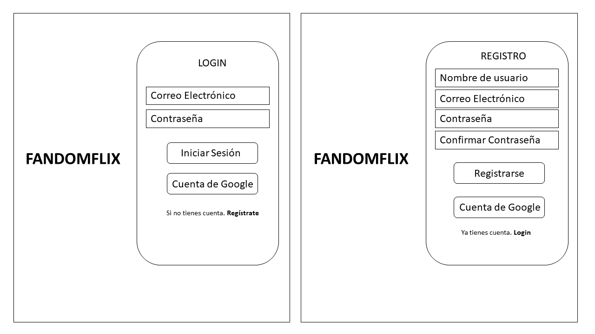
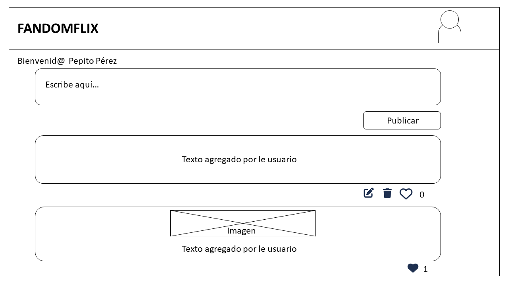

## 3.2 Prototipo de alta fidelidad 🚀
Después de recopilar comentarios importantes del prototipo de baja fidelidad, avanzamos a la fase de prototipo de alta fidelidad utilizando la plataforma de diseño  [_Figma_](https://www.figma.com/community). Aquí, refinamos la apariencia visual y el diseño con colores, tipografía y detalles visuales. Este prototipo de alta fidelidad nos permitió visualizar cómo cobraban vida nuestras ideas y resolver problemas de diseño, mejorando la experiencia del usuario de manera iterativa.

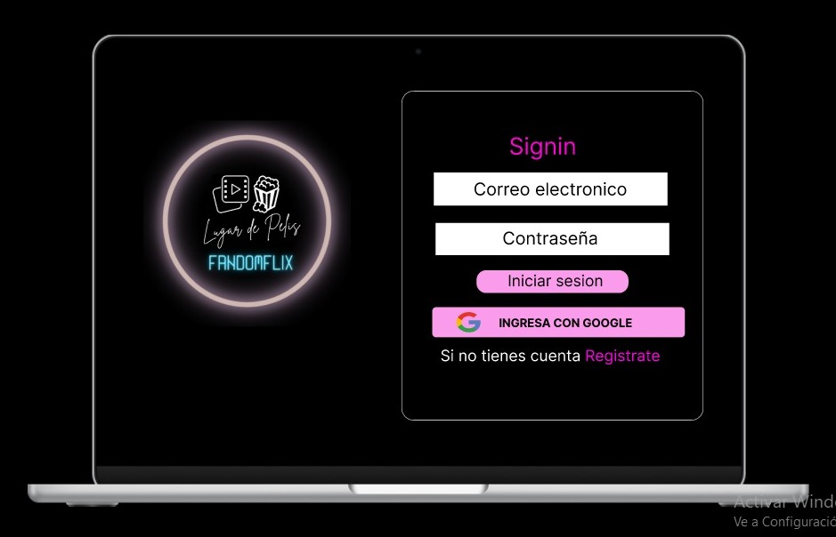
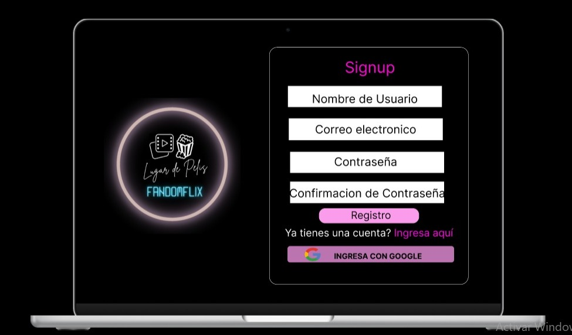
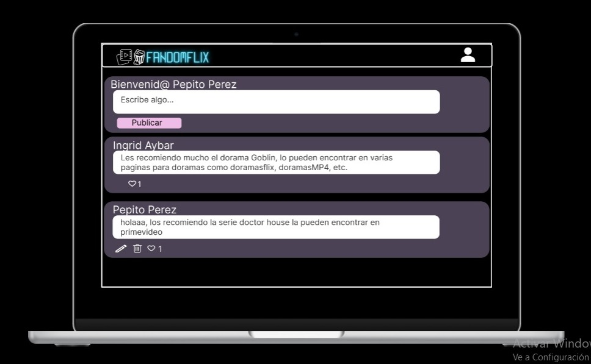

## 3.3 Testeo de Usabilidad 💡📊
A través de [_Forms_Google_](https://workspace.google.com/intl/es-419/products/forms/?utm_source=google&utm_medium=cpc&utm_campaign=latam-CL-all-es-dr-bkws-all-all-trial-e-dr-1011272-LUAC0011982&utm_content=text-ad-none-any-DEV_c-CRE_479425067880-ADGP_Hybrid%20%7C%20BKWS%20-%20MIX%20%7C%20Txt%20~%20Forms-KWID_43700057707270852-kwd-868999111187&utm_term=KW_crear%20google%20forms-ST_crear%20google%20forms&gclsrc=ds&gclsrc=ds) planteamos preguntas detalladas que abordaron aspectos clave de nuestra plataforma, desde la usabilidad hasta la eficacia de las funcionalidades. Esta recopilación de datos buscaba obtener una visión profunda de las impresiones de los usuarios, permitiéndonos optimizar cada aspecto de nuestra página. Valoramos enormemente las respuestas proporcionadas, ya que brindaron información crucial para la mejora de nuestro proyecto.

Te invitamos a participar en nuestra encuesta a través de este [_enlace_](https://forms.gle/pczJ2VrUVYx7pgBH7) 

También, adjuntamos el [_enlace_](https://1drv.ms/b/s!AlswOa-XpDefgWehwwyYEJHot24t?e=rSzyhV) que conduce a las respuestas compartidas por nuestros usuarios en relación a nuestro formulario."

## 3.4 Historias de Usuarios 🎲
  Según la necesidad de los usuarios y entendiendo lo que querían evidenciar en el sitio, realizamos 3 historias:
  
#### Primera historia de usuario 📖😉
  - **Yo como**: Usuario nuevo de FandomFlix.
  - **Quiero**: Poder registrarme en la página o loguearme con mi cuenta de Google.
  - **Para**: Poder ingresar a la página y ver el contenido de ella.

***Criterios de aceptación:***
  
 - Mostrar una página de bienvenida.
 -  Brindar la opción de loguearse con tu cuenta de Google.
 - Dar la opción de crear una cuenta.
 - Dar la opción de cerrar sesión.

***Definición de terminado:***
  
   - Crear dos vistas (login y registro), en estas vistas tendremos dos formularios, uno sería el de login y el segundo el de registro.
   - Adaptarlo a dispositivos móvil y tablet.
   - Icono de perfil con opción de cerrar sesión.
   - Validar  el correo.
   - Llenar todos los campos del formulario al hacer el registro.
  
#### Segunda historia de usuario 📖👀​
  - **Yo como**: Usuario de FandomFlix.
  - **Quiero**: Poder publicar texto e imagenes de peliculas y series.
  - **Para**: Generar nuevo contenido en la red social.
  
  **Criterios de aceptación**:
   - Poder ver la publicación en tiempo real..
   - Añadir la nueva publicación.
  
  **Definición de terminado**:
   - Crear una vista donde muestre un textarea que permita escribir y adjuntar imagenes.
   - Colocar un botón abajo del textarea que me permita publicar.
   - Validar que no haya campos vacios.
   
#### Tercer historia de usuario 📖😁
  - **Yo como**: Usuario de FandomFlix.
  - **Quiero**: Interactuar con las publicaciones
  - **Para**: Dar like, eliminar o editar la publicación.
  
  ***Criterios de aceptación***:
   - Poder modificar el contenido.
   - Poder eliminar la publicación.
   - Dar y quitar el like a una publicación.
   - Conteo de likes.
   
  ***Definición de terminado***:
   - Preguntar si desea eliminar la publicación.
   - Preguntar si desea cancelar o guardar la publicación editada.
   - Recargar la página se muestren los cambios realizados(editar o eliminar).
   - Al darle clic al icono del like que cambie de color.
   - Al quitar el click del like regrese a su color original.
   - Visualizar el contador de likes y que sea máximo uno por usuario.
   
**Herramienta utilizada**.
  - **Projects**: Organización de equipo. 
  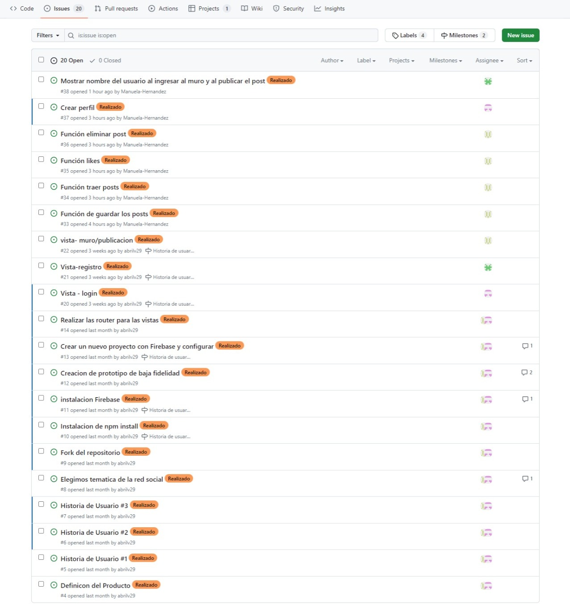

## 4. Herramientas de Elaboración.🛠️
Para este proyecto utilizamos:

### Uso de Firebase para crear el registro de usuarios y login
- Configuracion de firebases para poder usar Authentication y alamcenar el correo y contraseña de los usuarios.
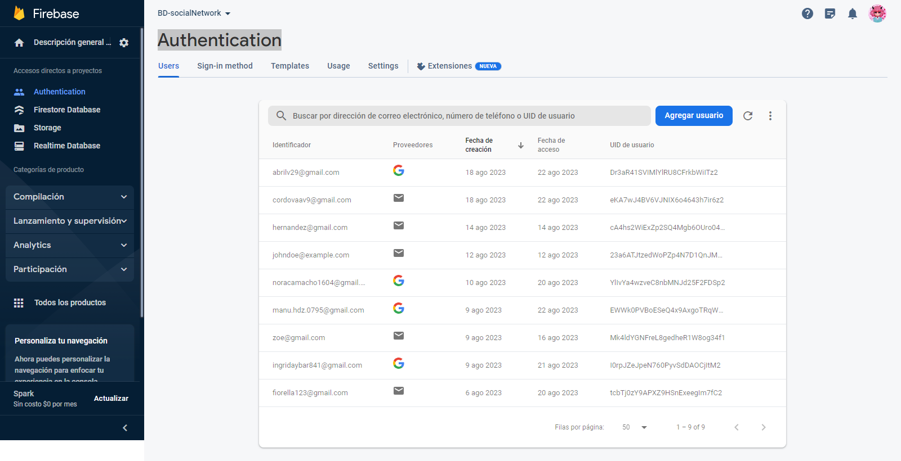

### Uso de Firestore Database
- Creacion de una tabla de registros de las publicaciones de nuestra red social **posts**

### Uso de Firebase Storage
- Almacenamiento  de nuestras publicaciones cuando se comparte una imagen.
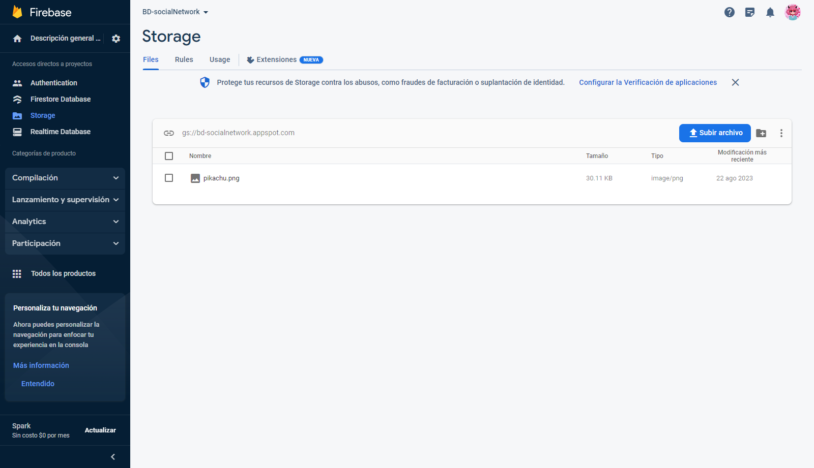
### Tambien usamos:
- HTML, CSS, JS
- Figma
## 5. Pruebas unitarias (unit tests) 🧪
- Dentro de nuestros test unitarios en este proyecto se uso las funciones simuladas para saber el compartamiento de nuestras funciones que estan ligadas con firebase. Para ello se tubo que comprender como funcionan los mocks y como implementarlos.
### Uso de Mocks
- Mocks: Las funciones mocks son funciones que permiten probar el comportamiento de una función que es llamada indirectamente por otro código, en lugar de solo probar la salida. Puedes crear una función falsa con jest.fn(). Si no se da la implementación, la función mockeda devolverá undefined cuando se invoque.
- Jest es una herramienta de testing para JavaScript que permite hacer mock de function o funciones de las maneras siguientes:
1. jest.fn(). Retorna un objeto de tipo Mock.
2. jest.mock('module', () => interfaz). Crea un mock de un módulo y en el callback defines la interfaz (nombres de funciones, sus parámetros y lo que quieras que retornen).
3. jest.spy(object, property, interfaz). Haces un spy a la propiedad de un objeto y puedes determinar la interfaz y el comportamiento del mismo.

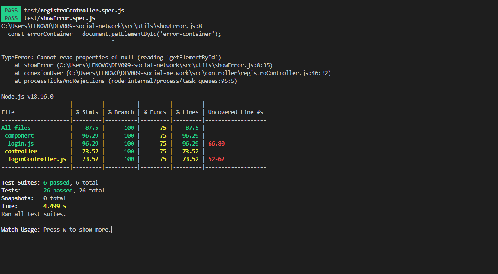